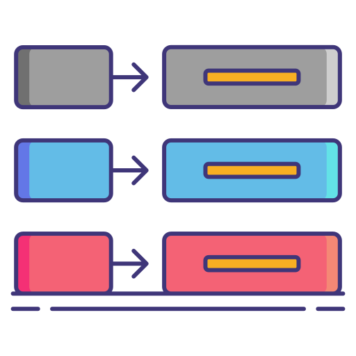

# Consul KV Migration utility

Key-value store is one of the important feature provided by Consul which is used by multiple Engineers for multiple use-cases.
Migration is one of the challenging task which user faces while using consul. So, We created python script will helps user to migrate key-value data from one consul server to another and also helps user to get information about migration by getting different types of output like in JSON & Table.

<p style="text-align:center;"></p>

## prerequisite
- Two consul servers
- python3
- libraries
  - from consul_kv import Connection
  - json
  - ast
  - prettytable
  - getopt
  - sys

## Get help using -h tag

```shell
python3 consul.py -h
```
output:
```
Usage: python <NAME-OF-SCRIPT>.py ... [ -<OPTIONS> <VALUES>]

Mendatory Option and arguments

-s : Provide source consul URL
     FORMAT: -s <VALUE>

-d : Provide destination consul URL
     FORMAT: -d <VALUE>

-o : Provide database hostname

     FORMAT: -o <VALUE>
     SUPPORTED TAGS:
         - json
         - table

AUTHOR: https://github.com/b44rawat
```

## Format

```shell
python3 consul.py  -s <SOURCE-ADDRESS> -d <DESTINATION-ADDRESS> -o table
```

## Output types

- table
- json

## Example 

```shell
 python3 consul.py  -s http://192.168.1.x:8500/v1/ -d http://192.168.0.x:8500/v1/ -o table
```

## OUTPUTS

- JSON

```json
["{ 'key': 'dir1/key3', 'value': 'value3', 'status': 'pass'}", "{ 'key': 'dir1/key4', 'value': 'value', 'status': 'pass'}", "{ 'key': 'dir1/subdir1/key6', 'value': 'value6', 'status': 'pass'}", "{ 'key': 'dir2/key7', 'value': 'value7', 'status': 'pass'}", "{ 'key': 'key1', 'value': 'value1', 'status': 'pass'}", "{ 'key': 'key2', 'value': 'value2', 'status': 'pass'}"]
```

- TABLE

```
+-------------------+--------+--------+
|        Key        | Value  | Status |
+-------------------+--------+--------+
|     dir1/key3     | value3 |  pass  |
|     dir1/key4     | value  |  pass  |
| dir1/subdir1/key6 | value6 |  pass  |
|     dir2/key7     | value7 |  pass  |
|        key1       | value1 |  pass  |
|        key2       | value2 |  pass  |
+-------------------+--------+--------+
```

## Upcoming

- YAML Output
- Token support

